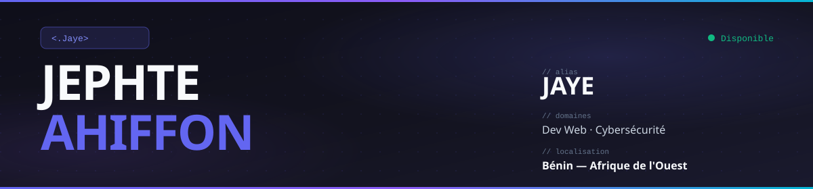
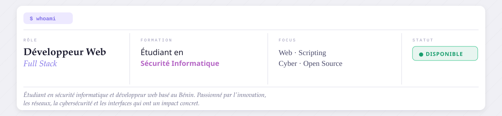

 

---

## `$ whoami`

---

## `$ ls ./stack`

---

## `$ cat ./stats`

  
  

  

  

---

## `$ git log --graph`

  

  <picture>
    <source media="(prefers-color-scheme: dark)"  srcset="https://raw.githubusercontent.com/J2e0p0t8e/J2e0p0t8e/output/github-contribution-grid-snake-dark.svg"/>
    <source media="(prefers-color-scheme: light)" srcset="https://raw.githubusercontent.com/J2e0p0t8e/J2e0p0t8e/output/github-contribution-grid-snake.svg"/>
    
  </picture>

---

## `$ ls ./projects`

<table>
<tr>
<td width="33%" align="center">

 <b><a href="https://vision-plus.tech">Vision+</a></b>
 Communauté tech · Blog automatisé · Fondateur
 <code>React</code> <code>Node.js</code> <code>Blog</code>
</td>
<td width="33%" align="center">

 <b><a href="https://test-web-3fah.onrender.com">IFRI Mentor Link</a></b>
 App de mentorat · Projet intégrateur IFRI · Équipe
 <code>Backend</code> <code>Frontend</code> <code>Render</code>
</td>
<td width="33%" align="center">

 <b><a href="https://jephtmail.vercel.app">Jayemail</a></b>
 Générateur de mails jetables · API Testmail
 <code>JavaScript</code> <code>Testmail</code> <code>Vercel</code>
</td>
</tr>
<tr>
<td width="33%" align="center">

 <b><a href="https://ui-two-drab.vercel.app">Mailtempo</a></b>
 Mail jetable &amp; permanent sur domaine propre · SMTP
 <code>React</code> <code>SMTP</code> <code>Domaine</code>
</td>
<td width="33%" align="center">

 <b><a href="https://academiagest.tech">Academiagest</a></b>
 Gestion d'établissement · Inscriptions · Notifs parents
 <code>Full Stack</code> <code>SMS/Mail</code> <code>SaaS</code>
</td>
<td width="33%" align="center">

 <b><a href="https://vision-quiz.vercel.app">Vision Quiz</a></b>
 Quiz interactif pour la communauté Vision+
 <code>React</code> <code>JavaScript</code> <code>Vercel</code>
</td>
</tr>
<tr>
<td width="33%" align="center">

 <b><a href="https://moneytrack-mocha.vercel.app">MoneyTrack</a></b>
 Gestion de fonds &amp; économies personnelles
 <code>React</code> <code>Tailwind</code> <code>Vercel</code>
</td>
<td width="33%" align="center">

 <b><a href="https://secureflow-zsjq.onrender.com">Secureflow AI</a></b>
 Analyse repo · Détection failles · Correctifs IA · Hackathon
 <code>Python</code> <code>IA</code> <code>GitHub API</code>
</td>
<td width="33%" align="center">

 <b>Bot Vision+</b>
 Bot Discord · Gestion membres · Musique · Lié au site
 <code>discord.js</code> <code>Node.js</code> <code>API</code>
</td>
</tr>
</table>

---

## `$ grep -r "axes_de_travail"`

- Développement web front & back — interfaces rapides, propres, accessibles
- Automatisation & scripting — Python, CLI, workflows
- Sécurité informatique — apprentissage des réseaux, systèmes, CTF
- Open source — contributions, projets communautaires
- Toujours en train d'apprendre quelque chose de nouveau

---

## `$ curl contact`

---

