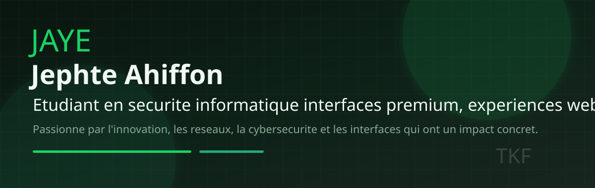
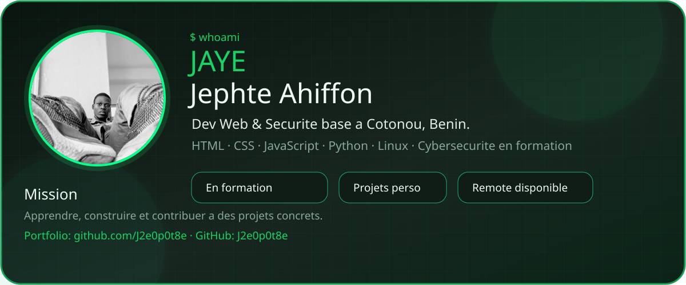
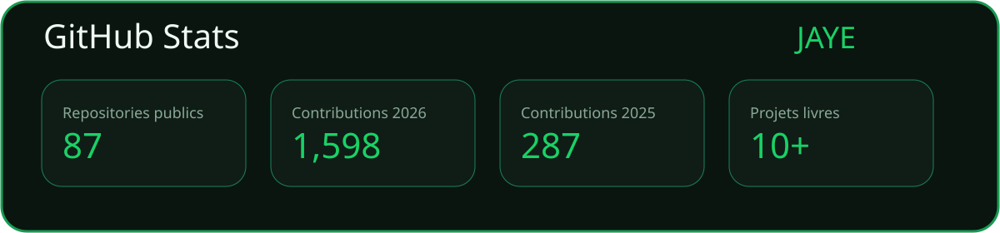
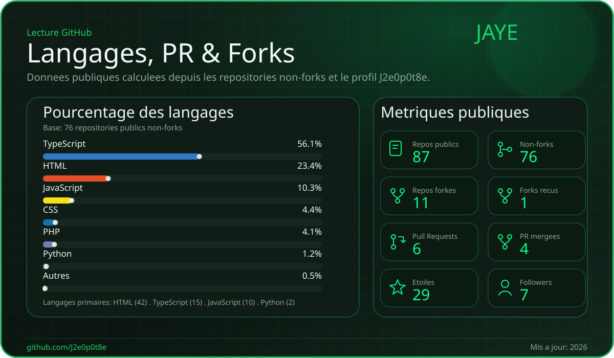
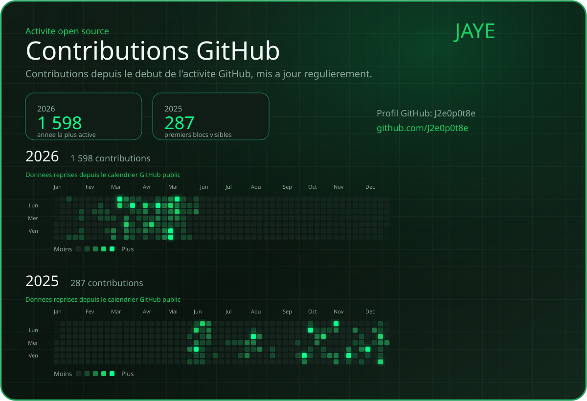
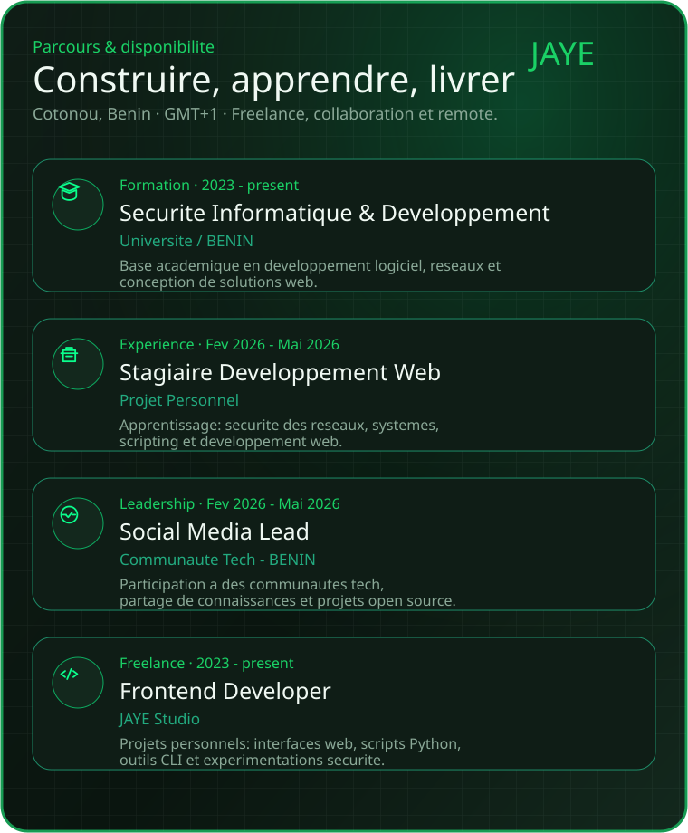
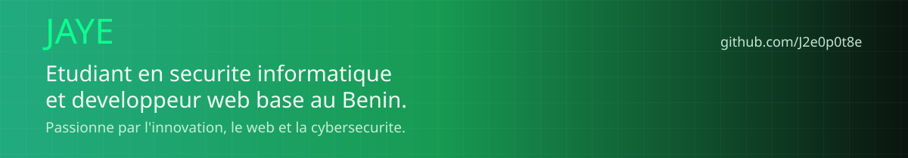

 

---

## `$ whoami`

---

## `$ ls ./stack`

---

## `$ cat ./stats`

  
  

  

---

## `$ git log --graph`

  

---

## `$ cat ./parcours`

---

## `$ grep -r "axes_de_travail"`

- Développement web front & back — interfaces rapides, propres, accessibles
- Automatisation & scripting — Python, CLI, workflows
- Sécurité informatique — apprentissage des réseaux, systèmes, CTF
- Open source — contributions, projets communautaires
- Toujours en train d'apprendre quelque chose de nouveau

---

## `$ curl contact`

---

